# Architecture Flowcharts

This document contains Mermaid flowcharts for explaining the research and code
architecture of the RRAM variability and compact-model fitting project.

The diagrams are intentionally split into multiple views:

- research architecture
- repository architecture
- artifact flow
- modern pipeline
- TaO-Fit architecture
- HSPICE fitting loop
- publication deliverables
- troubleshooting and interpretation

## 1. Research Architecture

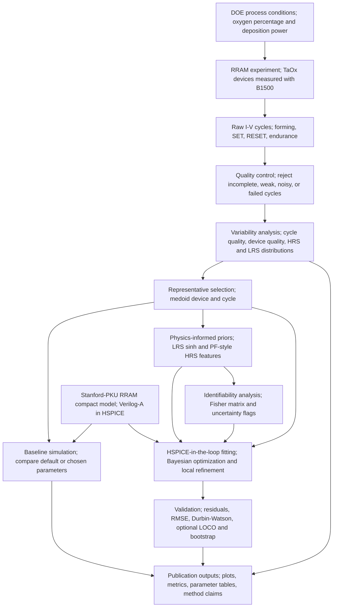

## 2. Repository Architecture

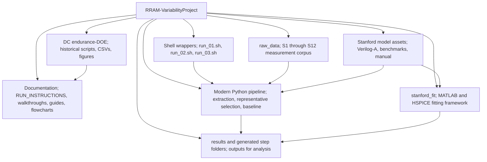

## 3. Scientific Artifact Flow

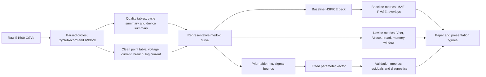

## 4. Modern Pipeline Execution Flow

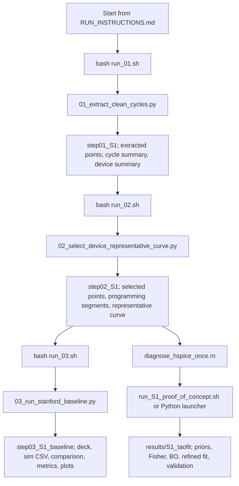

## 5. Stage 1 Extraction Architecture

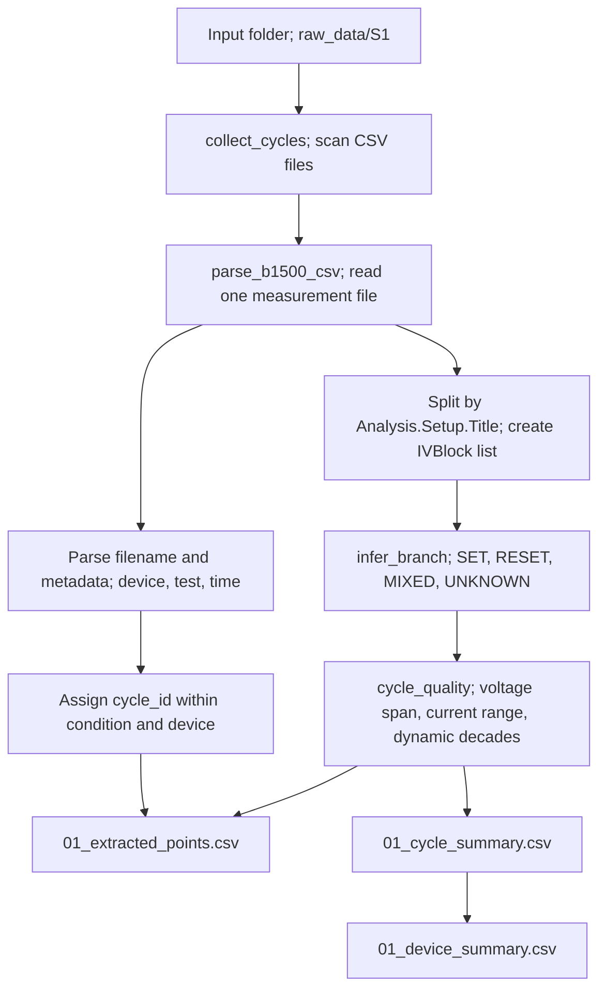

## 6. Stage 2 Representative Selection Architecture

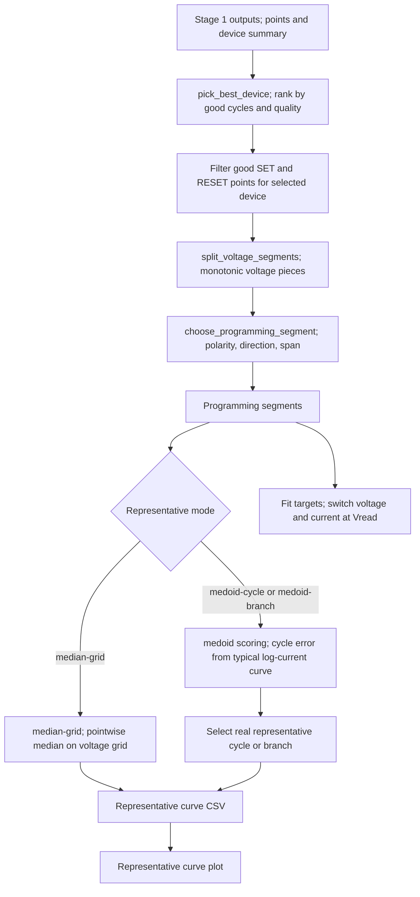

## 7. Stage 3 Baseline Simulation Architecture

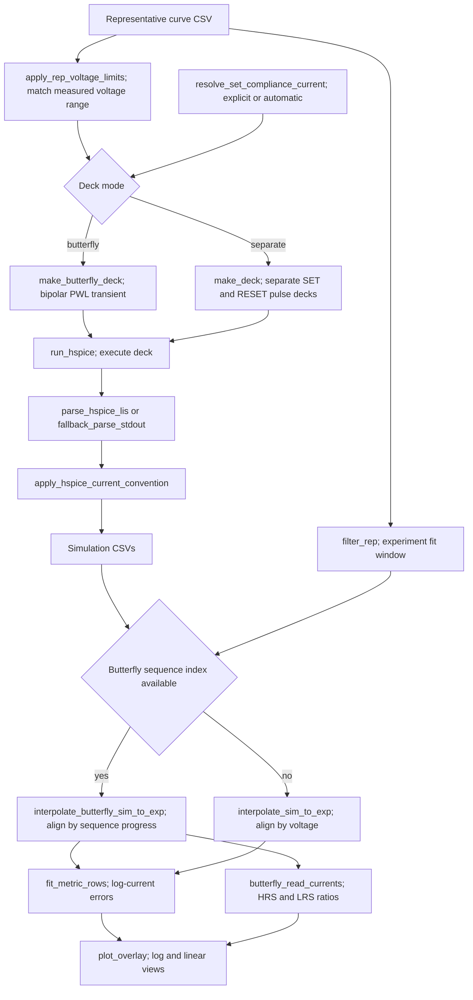

## 8. TaO-Fit MATLAB Architecture

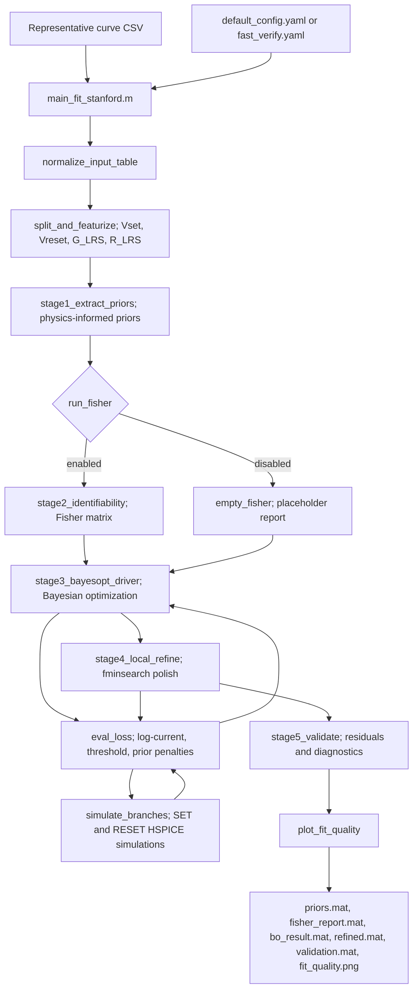

## 9. Physics-Informed Prior Flow

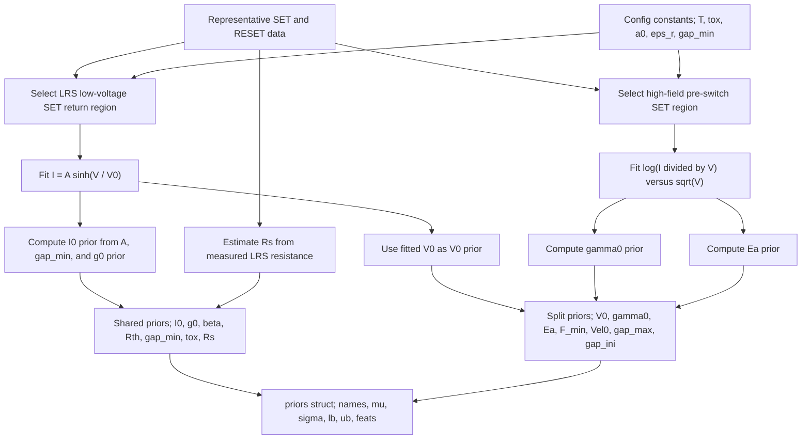

## 10. HSPICE-In-The-Loop Fitting Architecture

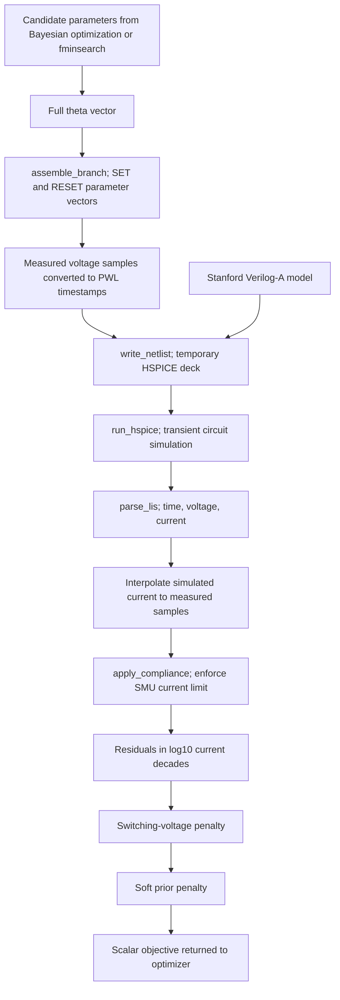

## 11. Publication Deliverable Flow

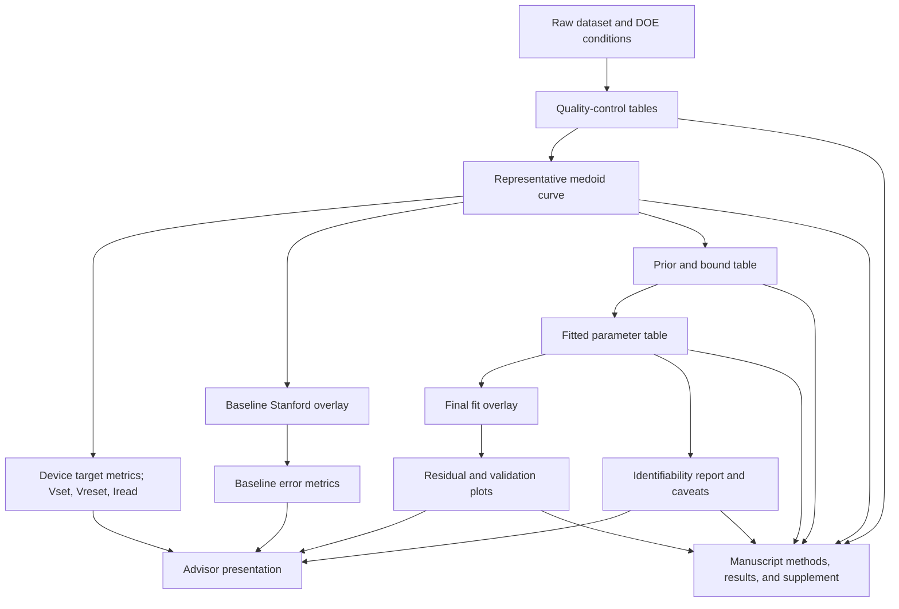

## 12. Interpretation And Troubleshooting Flow

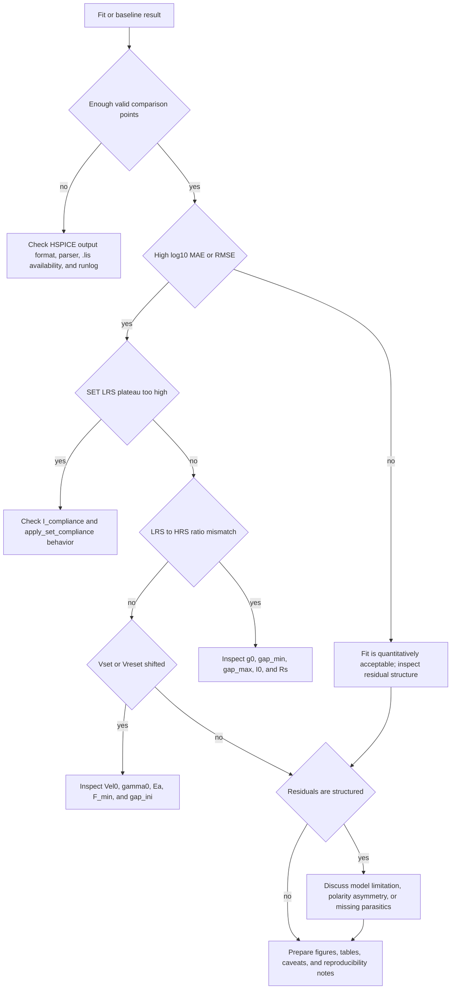

