# Codebase Mermaid Flowcharts

These Mermaid diagrams summarize the full codebase workflow, data movement,
module dependencies, and step-by-step algorithm logic. They are split into
multiple diagrams so each one stays readable.

## 1. High-Level Workflow

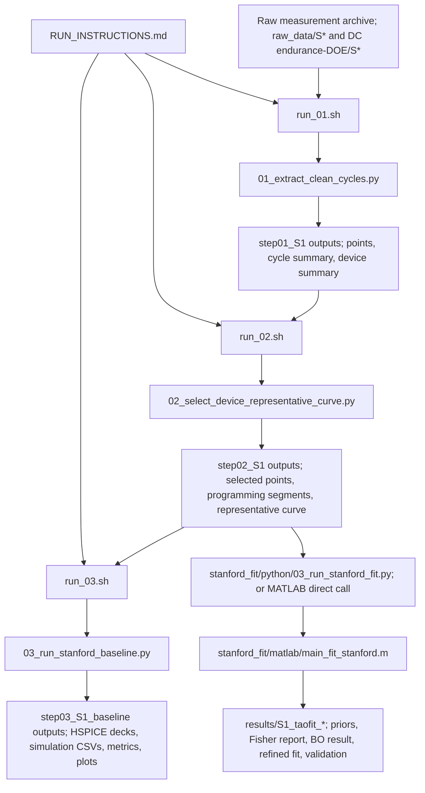

## 2. Data Flow And Artifacts

```mermaid
flowchart LR
    b1500Csv["B1500 CSV files; raw_data/S1/*.csv"]
    cycleRecords["CycleRecord objects; path, condition, device, blocks"]
    ivBlocks["IVBlock objects; title, voltage, current"]
    pointRows["Point rows; voltage_V, current_A, abs_current_A, log10_abs_current"]
    cycleSummary["01_cycle_summary.csv; quality per cycle"]
    deviceSummary["01_device_summary.csv; quality per device"]
    extractedPoints["01_extracted_points.csv; all normalized points"]
    selectedDevice["Selected condition and device"]
    selectedPoints["*_selected_points.csv"]
    programmingSegments["*_programming_segments.csv"]
    repCurve["*_representative_curve_FIXED.csv"]
    fitTargets["*_fit_targets_FIXED.csv"]
    experimentWindow["03_experiment_fit_window.csv"]
    hspiceDeck["HSPICE deck; butterfly_baseline.sp or branch decks"]
    hspiceLis["HSPICE output; .lis or runlog"]
    simCsv["03_all_sim.csv; and branch simulation CSVs"]
    comparisonCsv["03_exp_vs_baseline_comparison.csv"]
    metricsCsv["03_fit_metrics.csv; 03_read_ratio_summary.csv"]
    plots["Overlay plots; 03_baseline_overlay.png"]

    b1500Csv --> cycleRecords
    cycleRecords --> ivBlocks
    ivBlocks --> pointRows
    pointRows --> extractedPoints
    cycleRecords --> cycleSummary
    cycleSummary --> deviceSummary
    deviceSummary --> selectedDevice
    extractedPoints --> selectedDevice
    selectedDevice --> selectedPoints
    selectedPoints --> programmingSegments
    programmingSegments --> repCurve
    programmingSegments --> fitTargets
    repCurve --> experimentWindow
    repCurve --> hspiceDeck
    hspiceDeck --> hspiceLis
    hspiceLis --> simCsv
    experimentWindow --> comparisonCsv
    simCsv --> comparisonCsv
    comparisonCsv --> metricsCsv
    comparisonCsv --> plots
```

## 3. Module Dependency Map

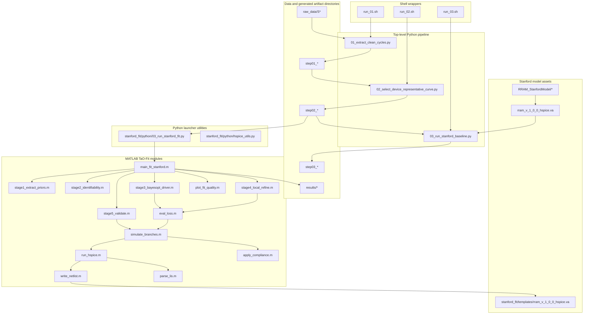

## 4. Stage 1 Algorithm: Extract And Score Cycles

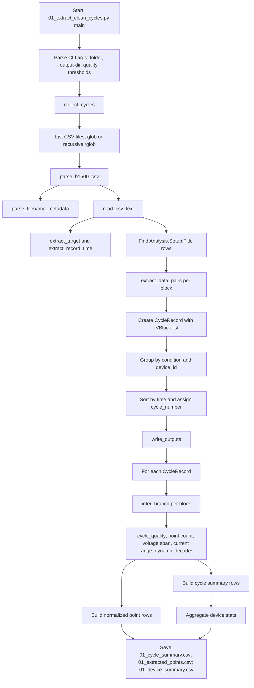

## 5. Stage 2 Algorithm: Select Representative Curve

```mermaid
flowchart TD
    startStageTwo["Start; 02_select_device_representative_curve.py main"]
    readStepOne["Read 01_extracted_points.csv; Read 01_device_summary.csv"]
    normalizeBool["Convert is_good_cycle with as_bool"]
    optionalFilters["Apply optional condition filter"]
    deviceChoice{"Was device-id provided"}
    manualDevice["Use requested device_id; and matching condition"]
    bestDevice["pick_best_device; sort by good_cycles, mean_quality_score, good_fraction"]
    filterPoints["Filter selected_points; condition, device, good cycle, SET or RESET"]
    buildSegments["build_programming_segments"]
    splitSegments["split_voltage_segments; cut on voltage direction changes"]
    scoreSegments["choose_programming_segment; branch polarity, direction, useful span"]
    modeChoice{"representative_mode"}
    medianGrid["median-grid path; make_voltage_grid and representative_branch_curve"]
    medoidPath["medoid path; representative_measured_curve"]
    scoreCycles["score_branch_cycles_against_typical; median abs log error vs typical grid"]
    selectMedoid["Select medoid-cycle or medoid-branch"]
    measuredCurve["measured_curve_from_cycle; copy real measured points into representative schema"]
    addMetadata["Add condition, device_id, butterfly_sequence_index"]
    targets["estimate_threshold and current_at_vread"]
    plotRep["plot_selected_device"]
    saveStageTwo["Save selected points, segments, representative curve, scores, targets, info, plot"]

    startStageTwo --> readStepOne
    readStepOne --> normalizeBool
    normalizeBool --> optionalFilters
    optionalFilters --> deviceChoice
    deviceChoice -->|"yes"| manualDevice
    deviceChoice -->|"no"| bestDevice
    manualDevice --> filterPoints
    bestDevice --> filterPoints
    filterPoints --> buildSegments
    buildSegments --> splitSegments
    splitSegments --> scoreSegments
    scoreSegments --> modeChoice
    modeChoice -->|"median-grid"| medianGrid
    modeChoice -->|"medoid-cycle or medoid-branch"| medoidPath
    medoidPath --> scoreCycles
    scoreCycles --> selectMedoid
    selectMedoid --> measuredCurve
    medianGrid --> addMetadata
    measuredCurve --> addMetadata
    addMetadata --> targets
    addMetadata --> plotRep
    targets --> saveStageTwo
    plotRep --> saveStageTwo
```

## 6. Stage 3 Algorithm: Baseline HSPICE Comparison

```mermaid
flowchart TD
    startStageThree["Start; 03_run_stanford_baseline.py main"]
    parseBaselineArgs["Parse representative CSV, Verilog-A path, deck mode, model parameters"]
    readRep["Read representative curve CSV"]
    autoLimits["apply_rep_voltage_limits; set_vmax and reset_vmin from measured voltage range"]
    filterExperiment["filter_rep; keep SET and RESET fit windows"]
    complianceChoice["resolve_set_compliance_current"]
    makeDeckChoice{"deck_mode"}
    makeButterfly["make_butterfly_deck; single bipolar PWL transient"]
    makeSeparate["make_deck for SET and RESET; legacy separate pulse transients"]
    runDecks["For each generated deck"]
    runHspicePy["run_hspice; execute hspice and save runlog"]
    parseLisPy["parse_hspice_lis; or fallback_parse_stdout"]
    validateSim["require_hspice_success; require_sim_points"]
    labelBranches["label_butterfly_branches; or assign branch label"]
    applyCompliancePy["apply_set_compliance"]
    saveSim["Save branch sim CSVs and 03_all_sim.csv"]
    compareChoice{"Butterfly sequence available"}
    compareButterfly["interpolate_butterfly_sim_to_exp; align by normalized sequence progress"]
    compareBranches["interpolate_sim_to_exp; align branch simulation by voltage"]
    metrics["fit_metric_rows; MAE, RMSE, median error, p90 error"]
    ratioSummary["butterfly_read_currents; read-current ratios at Vread"]
    plots["plot_overlay; log and linear overlays"]
    saveBaseline["Save comparison, parameters, metrics, ratios, plots"]

    startStageThree --> parseBaselineArgs
    parseBaselineArgs --> readRep
    readRep --> autoLimits
    autoLimits --> filterExperiment
    filterExperiment --> complianceChoice
    complianceChoice --> makeDeckChoice
    makeDeckChoice -->|"butterfly"| makeButterfly
    makeDeckChoice -->|"separate"| makeSeparate
    makeButterfly --> runDecks
    makeSeparate --> runDecks
    runDecks --> runHspicePy
    runHspicePy --> validateSim
    validateSim --> parseLisPy
    parseLisPy --> labelBranches
    labelBranches --> applyCompliancePy
    applyCompliancePy --> saveSim
    saveSim --> compareChoice
    compareChoice -->|"yes"| compareButterfly
    compareChoice -->|"no"| compareBranches
    compareButterfly --> metrics
    compareBranches --> metrics
    metrics --> ratioSummary
    ratioSummary --> plots
    plots --> saveBaseline
```

## 7. TaO-Fit Algorithm: MATLAB Optimization Pipeline

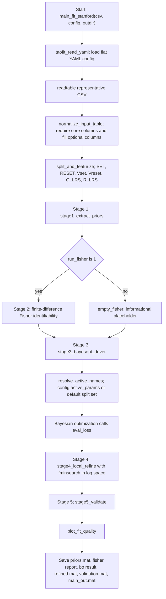

## 8. TaO-Fit Prior Derivation Logic

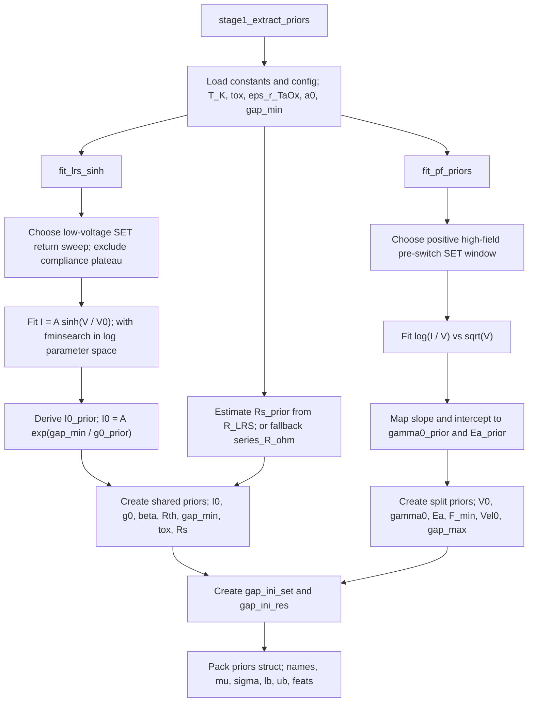

## 9. TaO-Fit Loss And HSPICE Forward Model

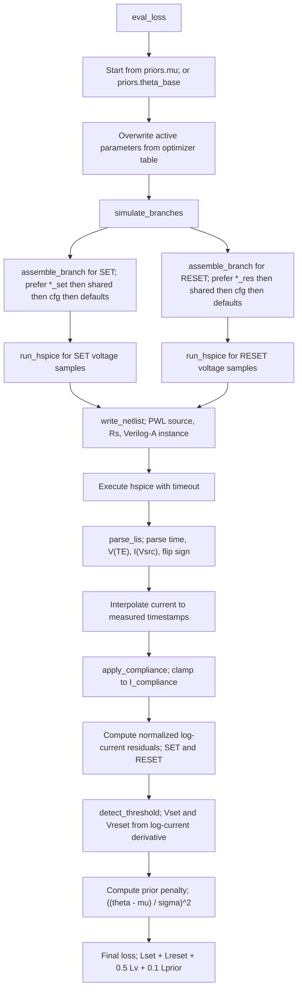

## 10. HSPICE Execution Sequence

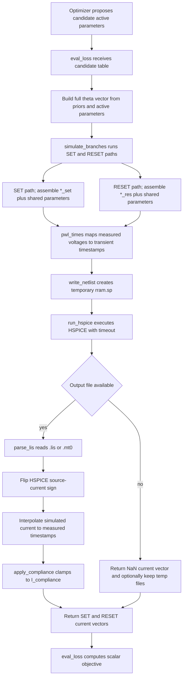

## 11. Legacy Archive Role

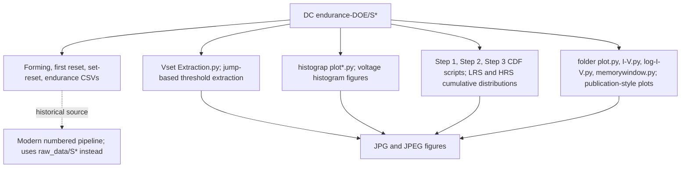
